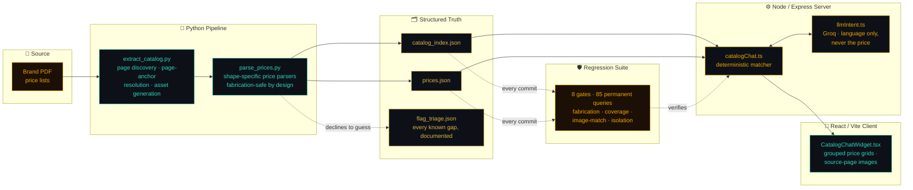

<!-- ══════════════════════════════════════════════════════════════════════════ -->
<!--                    ALTOSSA AI CATALOG AGENT — PROJECT README              -->
<!-- ══════════════════════════════════════════════════════════════════════════ -->

<div align="center">

<!-- HERO BANNER -->


<br/>

[](#-the-regression-gate)&nbsp;
[](#-the-regression-gate)&nbsp;
[](#-the-brand-roster)&nbsp;


</div>


<br/>

<!-- ═══════════════════════════════════════════════════════════════════════════
     SECTION 01 — WHAT THIS IS
══════════════════════════════════════════════════════════════════════════════ -->

<div align="center">

## ◆ What This Is

</div>

Luxury furniture catalogs live as scanned PDF price lists — hundreds of pages, dense tables,
per-tier fabric pricing, multi-page compositions, footnotes that change a price by 4%. Nobody
wants to page through a 700-page PDF to answer *"how much is the Cameo Maison in leather,
category U, size 220?"*

This project turns that PDF into a chat agent that answers instantly — and never guesses.

```python
#!/usr/bin/env python3
# ╔══════════════════════════════════════════════════════╗
# ║        ALTOSSA CATALOG AGENT  //  SYSTEM CORE        ║
# ╚══════════════════════════════════════════════════════╝

class CatalogAgent:
    MISSION      = "Turn scanned PDF price lists into a queryable source of truth"
    BRANDS_LIVE  = 6
    PRODUCTS     = 3_182
    PRICE_ROWS   = 64_330
    REGRESSION   = "8 gates · 85 permanent queries · 0 fabrication tolerated"

    PIPELINE = [
        "extract_catalog.py   → PDF pages become catalog_index.json",
        "parse_prices.py      → dense price tables become prices.json",
        "catalogChat.ts       → deterministic matching, LLM only for language",
        "regression/*.ts      → every claim re-verified against source, always",
    ]

    def rule_zero(self) -> str:
        return (
            "If the source data doesn't confidently answer a question, "
            "the agent says so — it never invents a number."
        )

agent = CatalogAgent()
print(agent.rule_zero())
# >> If the source data doesn't confidently answer a question,
#    the agent says so — it never invents a number.
```

<br/>


<br/>

<!-- ═══════════════════════════════════════════════════════════════════════════
     SECTION 02 — ARCHITECTURE
══════════════════════════════════════════════════════════════════════════════ -->

<div align="center">

## ◆ Architecture

</div>



> **Rule zero, load-bearing throughout:** the LLM step (`llmIntent.ts`) only ever interprets
> *what the user meant* — it never touches a price. Every number the agent shows was pulled
> verbatim from `prices.json`, which was pulled verbatim from a real PDF page. If the LLM is
> unavailable, the deterministic matcher takes over transparently; prices never depend on it
> being right.

<br/>


<br/>

<!-- ═══════════════════════════════════════════════════════════════════════════
     SECTION 03 — BRAND ROSTER
══════════════════════════════════════════════════════════════════════════════ -->

<div align="center">

## ◆ The Brand Roster

| ⬡ Brand | Products | Notes |
|:---|---:|:---|
| 🇮🇹 **Cattelan Italia** | 533 | First brand built; corruption-audit methodology later reused everywhere |
| 🇮🇹 **Bolzan** | 101 | Cameo Maison h-variant families |
| 🇮🇹 **Bonaldo** | 300 | Chair / table / sofa multi-shape parsers |
| 🇮🇹 **Varaschini** | 1,552 | Largest catalog · 5-shape price-table taxonomy (A–E) |
| 🇮🇹 **Ditre Italia** | 197 | Upholstery-category + material-finish dual-shape matching |
| 🇮🇹 **Pianca** | 499 | 10 source files · nested collision disambiguation across the whole brand |
| **Total** | **3,182 products / 64,330 rows** | Every row traceable to its own PDF page |

</div>

<br/>


<br/>

<!-- ═══════════════════════════════════════════════════════════════════════════
     SECTION 04 — TECH STACK
══════════════════════════════════════════════════════════════════════════════ -->

<div align="center">

## ◆ Tech Arsenal

**`// EXTRACTION & PARSING`**


<br/>

**`// SERVER & MATCHING`**


<br/>

**`// CLIENT`**


<br/>

**`// INTEGRITY & TESTING`**


</div>

<br/>


<br/>

<!-- ═══════════════════════════════════════════════════════════════════════════
     SECTION 05 — PIPELINE STAGES
══════════════════════════════════════════════════════════════════════════════ -->

<div align="center">

## ◆ Pipeline Stages

</div>

<br/>

<details>
<summary><b>📥 &nbsp; STAGE 1 — Extraction &nbsp;|&nbsp; <code>extract_catalog.py</code> &nbsp; 🟢 CORE</b></summary>

<br/>

>  

- Walks each brand's printed index (or, where no clean index exists, a manual page-map override) and resolves every product to a real PDF page range.
- Page-anchor resolution prefers the first **price-bearing** page over the first page a code is merely *mentioned* on — the root cause behind an entire class of "product exists but shows no price" bugs found and fixed this project.
- Generates per-product mini-PDFs, page images, and raw text — deduplicated by page, not by product, so a shared page isn't stored hundreds of times over.
- Every collision (two products sharing one printed name across brand sub-catalogs) is individually verified at the **code level** — never resolved by text similarity alone.

</details>

<br/>

<details>
<summary><b>🔎 &nbsp; STAGE 2 — Parsing &nbsp;|&nbsp; <code>parse_prices.py</code> &nbsp; 🟢 CORE</b></summary>

<br/>

>  

- One parser per real price-table **shape** — tiered fabric grids, dual-material columns, dense flat SKU lists, TSV-coordinate matrices for pages where linearized text scrambles row order beyond repair.
- **Declines rather than guesses.** A table shape the parser doesn't recognize produces a `known_gap` review flag, never a fabricated price — every flag is required to carry a triage entry before it can ship (`check-orphaned-flags`).
- Ambiguous source data (the same code genuinely listing two different prices in the PDF itself) is surfaced to the user as `ambiguous_price`, not silently resolved to a guess.

</details>

<br/>

<details>
<summary><b>💬 &nbsp; STAGE 3 — Chat Matching &nbsp;|&nbsp; <code>catalogChat.ts</code> + <code>llmIntent.ts</code> &nbsp; 🟢 CORE</b></summary>

<br/>

>  

- Deterministic-first: exact and fuzzy product-name matching, code lookup, tier/size/variant disambiguation — all runs with zero LLM dependency.
- The LLM step interprets phrasing and typos only; a `degraded: true` flag tells the client plainly when it's unavailable, rather than silently downgrading quality with no signal.
- Multi-product, multi-variant, and tied-candidate queries are handled by dedicated ambiguity resolvers — the full history of that logic is a graveyard of "looked plausible, broke on a real query" fixes, each now a permanent regression case.

</details>

<br/>

<details>
<summary><b>🖥️ &nbsp; STAGE 4 — Client &nbsp;|&nbsp; <code>CatalogChatWidget.tsx</code> &nbsp; 🟢 CORE</b></summary>

<br/>

>  

- Pivoted price grids (fabric tier × size), grouped by every dimension that actually distinguishes a row — not just the first one that happens to look unique.
- Source-page images one click away for every answer, so a user never has to trust the agent blind.
- Collapsible sections for bulky multi-category results, with an honest count of what's hidden rather than a silent truncation.

</details>

<br/>

<details>
<summary><b>🛡️ &nbsp; STAGE 5 — Regression Suite &nbsp;|&nbsp; <code>App/regression/*.ts</code> &nbsp; 🟢 CORE</b></summary>

<br/>

>  

- 8 independent gates, one command: `npm run regression:full`.
- Every one of the 85 permanent regression queries traces back to a real bug, once found live and never allowed to silently return.
- `list_orphan_data_files.ts` audits disk state against `catalog_index.json` as the single source of truth — no hand-written cleanup glob is trusted to delete anything, ever again.

</details>

<br/>


<br/>

<!-- ═══════════════════════════════════════════════════════════════════════════
     SECTION 06 — THE REGRESSION GATE
══════════════════════════════════════════════════════════════════════════════ -->

<div align="center">

## ◆ The Regression Gate

*Every change ships behind the same 8 gates. No exceptions, no "just this once."*

| ⬡ | Gate | What It Guarantees |
|:---:|:---|:---|
| 1️⃣ | `regression` | 85 permanent queries — every returned row exists verbatim in source data |
| 2️⃣ | `check-images` | Every shared page-image checksum is a verified legitimate same-page case |
| 3️⃣ | `check-coverage` | Every product's full price list matches source data exactly, brand-wide |
| 4️⃣ | `stress-v2` | No fabrication, no image-routing bugs under load |
| 5️⃣ | `check-multi-product-isolation` | Zero cross-product data leakage in combined queries |
| 6️⃣ | `check-tier-isolation-stress` | Deterministic + simulated-LLM tier resolution agree, every time |
| 7️⃣ | `check-tier-label` | Real category labels or honest fallbacks — never a wrong one |
| 8️⃣ | `check-orphaned-flags` | Every parser-declined row has a documented triage entry, no silent gaps |

```
╔══════════════════════════════════════════════════════════════════════════════╗
║                         LAST FULL RUN — ALL GREEN                           ║
╠══════════════════════════════════════════════════════════════════════════════╣
║                                                                              ║
║  ✅  Fabrication ................................  0 / 0  tolerated         ║
║  ✅  Row-count mismatches ........................  0                       ║
║  ✅  Suspicious image mismatches .................  0                       ║
║  ✅  Cross-product leakage .......................  0 / 10 cases            ║
║  ✅  Orphaned (untriaged) review flags ...........  0                       ║
║  ✅  Orphaned data files on disk .................  0                       ║
║                                                                              ║
╚══════════════════════════════════════════════════════════════════════════════╝
```

</div>

<br/>


<br/>

<!-- ═══════════════════════════════════════════════════════════════════════════
     SECTION 07 — RUNNING LOCALLY
══════════════════════════════════════════════════════════════════════════════ -->

<div align="center">

## ◆ Running Locally

</div>

```bash
# install
npm install

# start the API server (Express + chat matching) — :3000
npm run dev:server

# start the client (React + Vite) — :5173
npm run dev:client

# run the full 8-gate regression suite (server must be running)
npm run regression:full
```

Re-extracting or re-parsing a brand's data updates the files on disk, but the running server
caches each brand in memory — call `POST /api/catalog/reload/:brand` (or restart) before
trusting live query results against freshly regenerated data.

<br/>


<br/>

<!-- ═══════════════════════════════════════════════════════════════════════════
     SECTION 08 — ACTIVE DEVELOPMENT QUEUE
══════════════════════════════════════════════════════════════════════════════ -->

<div align="center">

## ◆ Active Development Queue

</div>

```
╔══════════════════════════════════════════════════════════════════════════════╗
║                          OPEN, TRACKED, NOT FORGOTTEN                       ║
╠══════════════════════════════════════════════════════════════════════════════╣
║                                                                              ║
║  🧩  Nested section-header capture  →  Pianca variant_context tracking      ║
║                                         needs 2+ page-shape-specific rules  ║
║  📊  Varaschini boundary sweep      →  100 pre-2026-08-24 suspected gaps    ║
║                                         awaiting individual verification    ║
║  🖼️  Cora-shape parser              →  mixed flat-finish + tier-category    ║
║                                         table shape, not yet recognized    ║
║                                                                              ║
╚══════════════════════════════════════════════════════════════════════════════╝
```

<br/>


<br/>

<div align="center">

```
╔══════════════════════════════════════════════════════════════════╗
║   "If the source doesn't say it, the agent doesn't say it."      ║
╚══════════════════════════════════════════════════════════════════╝
```

<br/>


</div>
